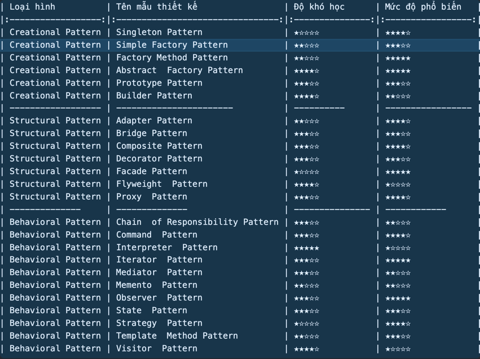
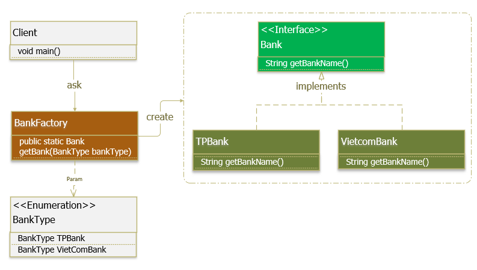

## Design Pattern là gì? [tài liệu tham khảo](https://gpcoder.com/category/design-pattern/)

* Kỹ thuật trong lập trình hướng đối tượng
* Cung cấp các mẫu thiết kế để giải quyết các vấn đề chung, thường gặp trong lập trình
* Được các kỹ sư kinh nghiệm thiết kế giúp giải quyết vấn đề một cách tối ưu nhất

## Design Pattern gồm 3 mẫu 

* Creational Pattern (nhóm khởi tạo: liên quan đến việc khởi tạo đối tượng): Abstract Factory, Factory Method, Singleton, Builder, Prototype
* Structural Pattern (nhóm cấu trúc: thiết lập định nghĩa, quan hệ giữa các đối tượng): Adapter, Bridge, Composite, Decorator, Facade, Proxy và Flyweight..
* Behavioral Pattern (nhóm hành vi: thực hiện hành vi các đối tượng): Interpreter, Template Method, Chain of Responsibility, Command, Iterator, Mediator, Memento, Observer, State, Strategy và Visitor.

--> 23 mẫu thiết kế theo sách "Elements of Reusable Object-Oriented Software" viết năm 1994 của 4 tác giả Erich Gamma, Richard Helm, Ralph Johnson và John Vlissides)

## Trước khi học Design Pattern thì cần có kiến thức gì?

#### 1. Nắm vững 4 tính chất OOP

* Tính trừu tượng (abstraction)
* Tính kế thừa (inheritance)
* Tính đóng gói (encapsulation) và che dấu thông tin (info hiding)
* Tính đa hình (Polymorphism)

Tài liệu tham khảo về tính trừu tượng quan trọng trong kiến trúc (https://200lab.io/blog/kien-truc-ung-dung-nen-bat-dau-nhu-the-nao/)

#### 2. Nắm vững nguyên lý SOLID trong thiết kế hướng đối tượng (https://gpcoder.com/4200-cac-nguyen-ly-thiet-ke-huong-doi-tuong/)

* S (Single responsibility principle - Nguyên lý đơn chức năng): Một class chỉ nên giữ 1 trách nhiệm duy nhất, chỉ có thể sửa đổi class với 1 lý do duy nhất
* O (Open-Closed principle - Nguyên lý đóng mở): Có thể thoải mái mở rộng 1 class, nhưng không được sửa đổi bên trong class đó
* L (Liskov substitution principle - Nguyên lý thay thế): Trong một chương trình, các object của class con có thể thay thế class cha mà không làm thay đổi tính đúng đắn của chương trình
* I (Interface segregation principle - Nguyên lý thay thế): Thay vì dùng 1 interface lớn, ta nên tách thành nhiều interface nhỏ, với nhiều mục đích cụ thể
* D (Dependency Inversion Principle - Nguyên lý đảo ngược phụ thuộc): 
  * Các module cấp cao không nên phụ thuộc vào các modules cấp thấp. Cả 2 nên phụ thuộc vào abstraction.
  * Interface (abstraction) không nên phụ thuộc vào chi tiết, mà ngược lại. ( Các class giao tiếp với nhau thông qua interface, không phải thông qua implementation.)

Lưu ý: Các mẫu design pattern có thể đáp ứng 1 hoặc nhiều tính chất của SOLID

### Danh sách các mẫu design pattern
> 
#### Nhóm Creational Pattern
* Factory Pattern (https://gpcoder.com/4352-huong-dan-java-design-pattern-factory-method)
  * Nhiệm vụ: quản lý và trả về các đối tượng theo yêu cầu, giúp cho việc khởi tạo đổi tượng một cách linh hoạt hơn.
  * Cài đặt: 
    > 
    1. Super Class (Bank): môt supper class trong Factory Pattern có thể là một interface, abstract class hay một class thông thường
    2. Sub Classes (TPBank, VietcomBank): các sub class sẽ implement các phương thức của supper class theo nghiệp vụ riêng của nó.
    3. Factory Class (BankFactory): chịu tránh nhiệm khởi tạo các đối tượng sub class dựa theo tham số đầu vào.
      > [!NOTE]  
      > Lưu ý: lớp Factory Class là Singleton hoặc cung cấp một public static method cho việc truy xuất và khởi tạo đối tượng. Factory class sử dụng if-else hoặc switch-case để xác định class con đầu ra

#### Nhóm Structural Pattern
* Adapter Pattern (https://gpcoder.com/4483-huong-dan-java-design-pattern-adapter/)
  * Nhiệm vụ: cho phép các inteface (giao diện) không liên quan tới nhau có thể làm việc cùng nhau. Đối tượng giúp kết nối các interface gọi là Adapter
  * Cài đặt: Có hai cách để thực hiện Adapter Pattern dựa theo cách cài đặt (implement)

* Bridge Pattern (https://gpcoder.com/4520-huong-dan-java-design-pattern-bridge/)
  * Nhiệm vụ: tách thành phần trừu tượng (abstraction) và thành phần thực thi (implementation) riêng biệt. Do đó, các thành phần này có thể thay đổi một cách độc lập mà không ảnh hưởng đến các thành phần khác. Thay vì liên hệ với nhau bằng quan hệ kế thừa, hai thành phần này liên hệ với nhau thông qua quan hệ “chứa trong” (object composition).

* Decorator Pattern (https://gpcoder.com/4574-huong-dan-java-design-pattern-decorator/)
  * Nhiệm vụ: 

#### Nhóm Behavioral Pattern
* Template Method (https://gpcoder.com/4810-huong-dan-java-design-pattern-template-method/)

* Strategy Method (https://gpcoder.com/4796-huong-dan-java-design-pattern-strategy/)

* State Pattern (https://gpcoder.com/4785-huong-dan-java-design-pattern-state/)

* 